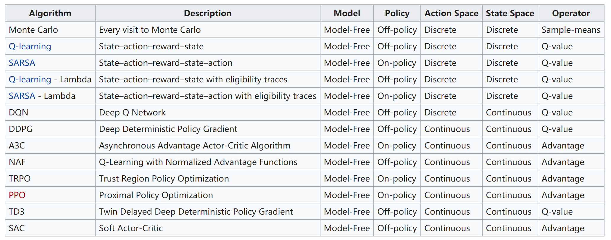

# Awesome-Multi-Agent

**:running::running::running:Under initial construction.**

**If you find something wrong or want to add something new, don't hesitate to make an issue or a PR.**

This repo is used to record  algorithms for multi-agent scenarios, either about a complete system, or part of it. 

For each paper, we should answer the following questions:
- What **problems** does it solve?
- What **methods** does it propose?
- How are the **results**?
- What **challenges** or **deficiencies** does it face?
- **Where** is it published? **Who** are the authors?

In addition, some related resources, such as hyperlinks to open-source codes and PDF files, are also welcome.

Topics & Quick jump:
  - [Basis of Reinforcement Learning](#basis-of-reinforcement-learning)
  - [Communication](#communication)
  - [Multi-player Games](#multi-player-games)

## Basis of Reinforcement Learning

### Comparison of RL algorithms (from [Wikipedia](https://en.wikipedia.org/wiki/Reinforcement_learning))

### A taxonomy of algorithms in modern RL (from [OpenAI](https://spinningup.openai.com/en/latest/spinningup/rl_intro2.html#citations-below))

#### Model-Free RL
- **[DQN 2013]** Playing Atari with Deep Reinforcement Learning ([pdf](https://www.cs.toronto.edu/~vmnih/docs/dqn.pdf))
  - introduces Deep Network to end-to-end RL (Q-learning)
- **[DDPG 2015]** Continuous control with deep reinforcement learning ([pdf](https://arxiv.org/pdf/1509.02971))
  - concurrently learns a deterministic policy and a Q-function by using each to improve the other
- **[TRPO 2015]** Trust Region Policy Optimization ([pdf](https://arxiv.org/pdf/1502.05477))
- **[A2C/A3C 2016]** Asynchronous Methods for Deep Reinforcement Learning ([pdf](https://arxiv.org/pdf/1602.01783))
  - performs gradient ascent to directly maximize performance
- **[PPO 2017]** Proximal Policy Optimization Algorithms ([pdf](https://arxiv.org/pdf/1707.06347))
  - maximizes a surrogate objective function which gives a conservative estimate for how much $J(\pi_{\theta})$ will change as a result of the update
- **[SAC 2018]** Soft Actor-Critic: Off-Policy Maximum Entropy Deep Reinforcement Learning with a Stochastic Actor ([pdf](https://arxiv.org/pdf/1801.01290.pdf))
  - uses stochastic policies, entropy regularization, and a few other tricks to stabilize learning and score higher than DDPG on standard benchmarks

[Back to top](#awesome-multi-agent)

## Communication

### 2018

- **[AAAI 2018]** Emergence of grounded compositional language in multi-agent populations ([pdf](https://www.aaai.org/ocs/index.php/AAAI/AAAI18/paper/viewFile/17007/15846))

### 2017

- **[NeurIPS 2017]** Multi-agent actorcritic for mixed cooperative-competitive environments ([pdf](https://papers.nips.cc/paper/7217-multi-agent-actor-critic-for-mixed-cooperative-competitive-environments.pdf))

### 2016 and before

- **[NeurIPS 2016]** Learning multiagent communication with backpropagation ([pdf](https://papers.nips.cc/paper/6398-learning-multiagent-communication-with-backpropagation.pdf))
- **[NeurIPS 2016]** Learning to
communicate with deep multi-agent reinforcement learning ([pdf](https://papers.nips.cc/paper/6042-learning-to-communicate-with-deep-multi-agent-reinforcement-learning.pdf))

[Back to top](#awesome-multi-agent)

## Multi-player Games

### TD-Gammon
- **[Communications of the ACM 1995]** Temporal difference learning and td-gammon ([pdf](https://cling.csd.uwo.ca/cs346a/extra/tdgammon.pdf))

### Go
- **[Nature 2016]** Mastering the game of go with deep neural networks and tree search ([pdf](https://www.nature.com/articles/nature16961.pdf))
- **[Arxiv 2017]** Mastering chess and shogi by self-play with a general reinforcement learning algorithm ([pdf](https://arxiv.org/pdf/1712.01815.pdf))
- **[Science 2018]** A general reinforcement learning algorithm that masters chess, shogi, and Go through self-play ([pdf](https://science.sciencemag.org/content/sci/362/6419/1140.full.pdf))

### Dota
- OpenAI Five ([blog](https://openai.com/blog/openai-five/))

### Capture-the-Flag
- **[Science 2019]** Human-level performance in 3D multiplayer games with population-based reinforcement learning ([pdf](https://science.sciencemag.org/content/sci/364/6443/859.full.pdf))

### StarCraft
- AlphaStar: Mastering the real-time strategy game StarCraft II ([blog](https://deepmind.com/blog/article/alphastar-mastering-real-time-strategy-game-starcraft-ii))

### Hide-and-Seek
- **[Arxiv 2019]** Emergent Tool Use From Multi-Agent Autocurricula ([pdf](https://arxiv.org/pdf/1909.07528.pdf))([code](https://github.com/openai/multi-agent-emergence-environments))([blog](https://openai.com/blog/emergent-tool-use/))

[Back to top](#awesome-multi-agent)